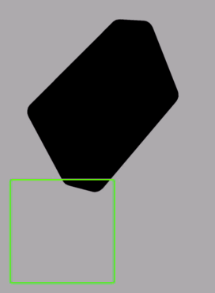

# SceneKitFrontFaceCullingBug
SceneKit allows you to use a SKScene as a 2D overlay for your 3D scene; quite handy for HUDs. However there seems to be a bug whereby turning on front face culling on any material in your scene will cull the overlay. The gif below shows this quite well, the red 2d square is part of a SKScene overlay, toggling the cullMode of the rotating box results in the SKScene overlay also being culled.

